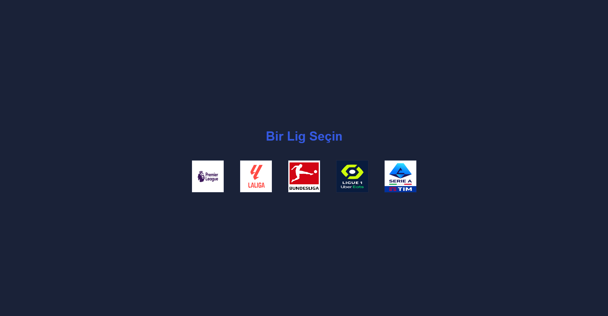
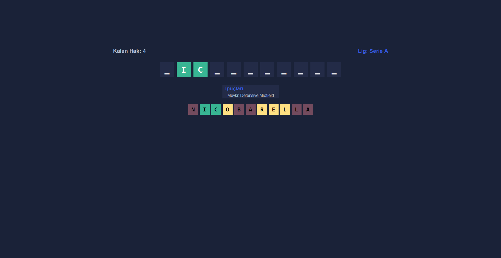
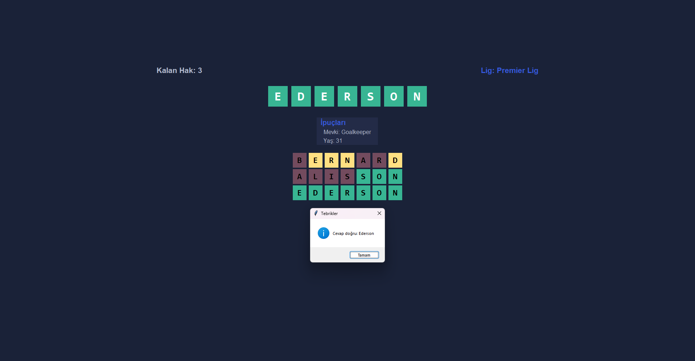

# Futbolcu Tahmin Oyunu

Avrupa'nın 5 büyük liginden futbolcularla oynanan, Wordle benzeri bir tahmin oyunudur. Her yanlış tahmin yeni bir ipucu açar; doğru ismi bulana kadar tahmin etmeye devam et!

---

## 🐍 Gereksinimler

- Python 3.10+
- [Pillow](https://pypi.org/project/Pillow/)
- [requests](https://pypi.org/project/requests/)
- tkinter (Python ile birlikte gelir)

Gereken kütüphaneleri yüklemek için:

```bash
pip install -r requirements.txt
```

---

## 🗂️ Proje Yapısı

```
.
├── pythonodevi.py               # Ana oyun dosyası
├── oyuncu_olustur.py            # API'den oyuncu verisi çekme (varsa)
├── secili_takim_oyuncular.json  # Oyuncu verileri
├── requirements.txt             # Gerekli kütüphaneler
├── README.md                    # Proje açıklaması
├── logos/                       # Lig logoları (doğru isimlendirme önemli!)
│   ├── bundesliga.png
│   ├── la liga.png
│   ├── ligue 1.png
│   ├── premier lig.png
│   └── serie A.png
└── screenshots/                 # Oyun içi ekran görüntüleri (README için)
    ├── ana_menu.png
    ├── oyun_ekrani.png
    └── dogru_tahmin.png

```

---

## 🚀 Başlangıç

1. Gerekli bağımlılıkları kurun:

   ```bash
   pip install -r requirements.txt
   ```

2. Oyunu başlatın:

   ```bash
   python pythonodevi.py
   ```

3. Opsiyonel olarak, yeni futbolcu verisi çekmek isterseniz:

   ```bash
   python oyuncu_olustur.py
   ```

   > ⚠️ Not: API kullanım sınırı dolabilir. Böyle bir durumda daha sonra tekrar deneyin.

---

## 🎮 Oyun Mekaniği

- Lig logolarından birine tıklayarak oyun başlar.
- Rastgele seçilen futbolcunun adını harf harf tahmin edersiniz.
- 5 tahmin hakkınız vardır.
- Her yanlış tahminle sırayla şu ipuçları açılır:
  1. Mevki
  2. Yaş
  3. Takım
  4. Uyruk
- Doğru ismi bulduğunuzda yeni bir futbolcu gelir.
- 5 hak bittiğinde cevap gösterilir ve ana menüye dönersiniz.

---

## 🖼️ Ekran Görüntüleri

**Ana Menü**  


**Tahmin Ekranı ve İpuçları**  


**Doğru Tahmin Sonrası**  


---

## 🧠 Kullanılan Kütüphaneler

- `requests` – API'den veri çekmek için
- `json` – JSON işlemleri
- `tkinter` – Arayüz (yerleşik gelir)
- `PIL (Pillow)` – Görsel gösterimi
- `os`, `sys`, `random` – Standart Python modülleri

---

## 📄 Lisans & Katkı

Bu proje eğitim ve ödev amaçlıdır. Kendi logo ve veri setlerinizle dilediğiniz gibi özelleştirebilirsiniz.

---

**İyi oyunlar!**
